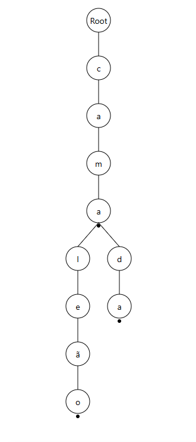
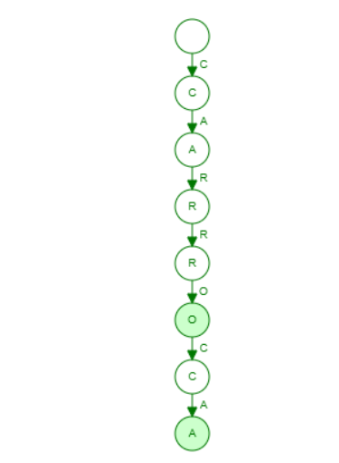

# 1 Motivação
# 2 Introdução
# 3 Implementação
## 3.1 Estruturas fundamentais
### 3.1.1 Node
Os nós na implementação de uma Trie, assim como em Linked Lists ou outra estrutura que os utilize, são as peças do quebra-cabeça. Sem eles, não existe implementação.
#### 3.1.1.1 Atributos
A primeira vista pode ser estranho e incomum, mas o nó não armazena o valor que representa dentro da estrutura da Trie, pois aqui, não temos um nó que se linka com outro através de apontadores como "left" ou "right", os nós armazenam algo mais interessante...

**HashMap:** 

Para fins didáticos, nossa implementação aborda a manipulação de palavras na Trie e as armazena em um HashMap. Caso você pare um pouco para pensar, verá que de acordo com nossa abordagem, o HashMap guardará no máximo 26 pares de <Chave, Valor>, onde a chave é cada letra do alfabeto, e seu valor é o nó que o representa. Desta forma, podemos pesquisar por várias palavras que contenham o mesmo prefixo com a mesma eficiência.

**Indicador de fim de palavra:**

Este atributo é extremamente importante para o funcionamento da Trie por definir se uma palavra está presente na  estrutura ou não. Ele é um atributo booleano que define se certa letra representa o fim de uma palavra dentro da Trie. 

- **Exemplo:**
> Digamos que adicionamos a palavra "Carrossel".
>
>Nossa estrutura ficaria assim: ROOT -> C -> A -> R -> R -> O -> S -> S -> E -> <b>L</b>
>
> Podemos pesquisá-la através do método search que veremos adiante, e o retorno será **true**, pois ela foi inserida. Agora caso pesquisarmos pela palavra "Carro", comumente se pensaria que ela está ao visualizar a estrutura que temos, porém ela nunca foi adicionada. Para isso que temos nosso atributo mágico "wordEnd", que define se certo nó que representa uma letra n também se refere ao fim de uma palavra. Nosso algoritmo olharia para o nó que representa a letra "o" da **nossa estrutura** e se perguntaria "Esta letra é o fim de uma palavra?". E no nosso caso, essa resposta seria **false**.

- Veja a implementação da classe Node (Atributos e construtor):

```java
 public class Node {

    boolean wordEnd;
    HashMap<Character, Node> sons;

    public Node() {
      this.wordEnd = false;
      this.sons = new HashMap<>();
    }
}
```

Para a realização das operações, ela conta com os seguintes métodos:

- getSons(): Retorna o mapa de filhos do nó.
- isEndOfWord(): Retorna o valor do atributo wordEnd.
- setEndOfWord(): Torna true o valor do atributo wordEnd.
- turnOffEndOfWord(): Torna false o valor do atributo wordEnd.

### 3.1.2 Trie
A classe Trie é o maestro da orquestra, ela coordena e controla todos os métodos para formar a estrutura, se formos encaixar na metafora do quebra-cabeça, a Trie é quem o monta. Ela conta apenas com um único atributo estático nomeado "root", que não corresponde à caractere algum. 

Todos os nós partem do root.

- Veja abaixo a parte inicial do código da classe Trie:

```java
public class Trie {

  private final Node root;

  public Trie() {
    this.root = new Node();
  }
}
```

## 3.2 Operações

A maioria dos métodos que veremos são bem intuitivos e nada complexos de serem compreendidos, vamos à leitura.
### 3.2.1 Inserção

A inserção de uma palavra na Trie, ocorre caractere por caractere. onde no fim, o nó que representa a última letra da palavra terá seu atributo "endWord" setado como true.

**Vamos exemplificar com a adição da palavra "Material":**

A ideia é iterar sobre a palavra de tal forma que adicionemos letra por letra.

Primeiro, criamos um nó auxiliar partindo do nó root (Node nodeAux). Como sabemos, cada nó tem um HashMap com as letras que partem dele. Dado isso, verificamos se no HashMap de nodeAux, com sua chave sendo a primeira letra da palavra, (m), o valor resultante é um nó ou não. Caso o valor retornado seja null, isso significa que, já que estamos partindo do root, não há nenhuma palavra que inicie com a letra m na estrutura, pois não há um nó no valor afiliado à ela. Sendo assim, temos que criar um novo nó e associá-lo. Desta forma, agora temos um nó representando aquele caractere no root.

Para exemplificar melhor, vamos à um universo paralelo onde a palavra "Marca" já foi adicionada e queremos adicionar "Material". Ao iniciar do root, veremos que em seu HashMap, a chave "m" resulta em um nó, que por sua vez, em seu HashMap, a chave "a" retorna um nó, mas que agora, por sua vez, a chave "t" retorna um valor null, diferente se se verificarmos a chave "r" da palavra "Marca". Portanto, seria necessário instanciar um novo nó e adicioná-lo ao valor da chave "t".

Voltando ao nosso universo canônico, temos a atualização de nodeAux. Como verificamos se a primeira letra "existia" na estrutura, e caso ainda não existisse, adicionamos-a, nodeAux agora será o nó que representa a primeira letra, e agora vamos verificar a existência de um nó que represente a segunda, (a). Veja que é como se tivéssemos dado 1 passo de nó para nó. Estávamos em root, e agora pulamos para o nó da primeira letra. A partir de agora, o processo se repete, verificando se a próxima letra como chave tem algum nó filho instanciado no HashMap do nó atual, se sim, apenas é dado um nodeAux = son, caso contrário, como visto antes, o nó é criado e associado à letra.

Nossa última etapa ocorre após a verificação e adição da última letra, pois estando com ela nas mãos, temos que setar como true o atributo de seu nó que indica que ela é o fim de uma palavra. Após isso, a adição foi concluída com sucesso. 

 - Para melhor compreensão, segue a implementação do método:

```java
 public void add(String word) {
    word = word.toLowerCase();

    Node nodeAux = this.root;

    for (int i = 0; i < word.length(); i++) {
      Node son = nodeAux.getSons().get(word.charAt(i));

      if (son != null) {
        nodeAux = son;

      } else {
        Node newNode = new Node();
        nodeAux.getSons().put(word.charAt(i), newNode);
        nodeAux = newNode;
      }
    }

    nodeAux.setEndOfWord();
  }
```

### 3.2.2 Pesquisa

O método de pesquisa tem como parâmetro a palavra a ser pesquisada na árvore e retorna um valor booleano baseado na pergunta "A palavra está na árvore?"

Assim como em todos os métodos, partimos do nó root, só que diferente da adição, nossas ações baseadas nas verificações são mais simples.

Da mesma forma que o método da inserção de palavras, temos que analisar se no HashMap do nó atual, temos uma referência associada à chave da próxima letra, um nó, ou se temos o valor null. 

Caso o retorno da chave seja null, isto indica que não temos um nó referenciando a letra que estamos verificando na vez, portanto, ela nunca foi adicionada. Neste momento, podemos e devemos retornar o valor **false** para o método, indicando que a palavra não está na estrutura.

Caso contrário, ou seja, o valor de retorno seja um nó, passamos a verificar seu HashMap à procura da próxima letra, e assim em diante.

Daí pode-se pensar que é basicamente isso, dado que caso todas as letras estejam presentes na estrutura obviamente a palavra inteira está presente. Porém, vamos a um exemplo prático:

**Supomos que adicionamos a palavra "Carrossel" e pesquisamos a existência de "Carro":**

<div align="center">
ROOT -> C -> A -> R -> R -> O -> S -> S -> E -> <b>L</b>
</div>

> Podemos visualizar através da explicação do material, que a partir do nó root, será validada a existência da letra "c", logo após, em seu nó, a existência da letra "a", e assim em diante até chegarmos na verificação da existência da letra "o". Acabou, né? Confirmamos que a palavra "Carro" está presente e podemos retornar **true**...

> É isso que a estrutura apresentada indica, mas nós nunca digitamos o comando add("Carro"), correto? Para isso, utilizamos o atributo que já foi mencionado no material anteriormente, que indica se certa letra representa o fim de uma palavra.
> Isso seria, obviamente, testado na última letra da palavra pesquisada, no nosso caso, o "o", retornando o valor booleano **false**.

- Para melhor compreensão, segue a implementação do método:

```java
public boolean search(String word) {
    word = word.toLowerCase();

    Node nodeAux = this.root;

    for (int i = 0; i < word.length(); i++) {
      Node son = nodeAux.getSons().get(word.charAt(i));

      if (son == null) return false;

      nodeAux = son;
    }

    return nodeAux.isEndOfWord();
  }
```

### 3.2.3 Prefixos

A jornada que o método que pesquisa por um prefixo percorre é idêntica ao search que vimos anteriormente, alterando apenas 1 detalhe que simplifica o código. Ou seja, se você sabe implementar o search(), sabe implementar o startsWith(). 

O método recebe como parâmetro um prefixo e retornará um valor booleano referente à existência de qualquer palavra que contenha aquele prefixo.

Assim como no search(), o startsWith() percorrerá letra por letra da palavra verificando se ela existe no mapa de seu nó parent, caso a letra não tenha valor referente, o retorno é **false**, caso contrário chegamos no ponto que o diferencia do search().

Ao chegar na última letra, como estamos tratando de prefixos e não de palavras completas, é irrelevante a verificação isEndOfWord() do nó, portanto, se ao longo do loop o caminho não quebrar e chegar ao fim, apenas retornamos **true**.

- Segue a implementação:

```java
public boolean startsWith(String prefix) {
    prefix = prefix.toLowerCase();

    Node nodeAux = this.root;

    for (int i = 0; i < prefix.length(); i++) {
      Node son = nodeAux.getSons().get(prefix.charAt(i));

      if (son == null) return false;

      nodeAux = son;
    }

    return true;
  }
```
### 3.2.4 Remoção 

O método da remoção de uma palavra da Trie segue uma sequência de fatos e conta com 2 partes em sua remoção: 

-  **Remoção lógica:** Desliga o atributo endWord do nó referente a última letra da palavra
-  **Remoção física:** Através de uma verificação consegue saber quando está autorizado a remover completamente a referência ao caractere.

Veremos com mais detalhes os momentos onde as duas partes ocorrem a seguir, mas antes temos que nos inserir nos passos do método de remoção em ordem cronológica.

**Parte 1: Descida**

Inicialmente, temos que descer até o último caractere da palavra, mas, diferente da forma que iteramos por ela até agora, desta vez faremos esse passo recursivamente.

Chamaremos nosso método privado recursivo com 3 parâmetros:

- A palavra a ser removida
- O nó atual
- Índice atual

Sendo os 2 útimos primeiramente:

- this.root
- 0

Nosso algoritmo, enquanto descemos, se baseará em pegar o nó referente a letra atual que estamos tratando e chamar recursivamente. Apenas isso. Simples, não é? Só precisamos substituir nos parâmetros o nó anterior pelo atual e incrementar no index.

**Parte 2: Remoção lógica**

Ao chamarmos o método recursivamente suficiente até o index na qual estamos ser igual ao tamanho da nossa palavra - 1, o que significa que estamos no nó da última letra, aplicamos a remoção lógica, que pode ser traduzida para a desativação do atributo de finalização de palavra do nó e retornamos a função com um valor booleano, que nos informa se o mapa dos filhos do nó é vazio, o que nos levará à nossa outra remoção.

**Parte 3: Subida e remoção física:**

Para subir de volta na árvore utilizaremos a parte dos retornos da função de remoção. 

Cada retorno da função é armazenado em um atributo booleano, que como dito antes, é baseado no fato do mapa de filhos do nó ser vazio ou não. Isso serve para nos indicar se o nó pai tem autorização de remover fisicamente o nó filho de seu mapa, o que não pode acontecer caso o filho tenha alguém referenciado no seu mapa de filhos para não quebrar a construção da árvore.

Caso o retorno tenha sido **true**, o nó remove de seu mapa o valor da chave atual, e após essa verificação, já que a partir de agora não temos certeza se estamos em um nó que é considerado fim de uma palavra, temos que retornar o valor booleano baseado em 2 coisas:

- O mapa do nó é vazio
- Ele não é fim de uma palavra

A partir desse retorno podemos com segurança avisar ao nó pai se ele pode remover fisicamente seu filho ou não.

Com esses passos subimos a árvore até terminar nossa pilha de execução, finalizando a função do método.

- Segue abaixo a implementação do método "remove":

```java
public void remove(String word) {
    word = word.toLowerCase();

    remove(word, this.root, 0);
  }

private boolean remove(String word, Node node, int index) {
    Node son = node.getSons().get(word.charAt(index));

    if (son == null) return false;

    if (index == word.length() - 1) {
      son.turnOffEndOfWord();
      return son.getSons().isEmpty();

    } else {
      boolean canRemove = remove(word, son, index + 1);
      if (canRemove) node.getSons().remove(word.charAt(index));
      return node.getSons().isEmpty() && !node.isEndOfWord();
    }
  }
```
## 3.2.5 Listagem de palavras por prefixos

A função deste método é nos retornar uma lista com todas as palavras que iniciam com o prefixo passado como parâmetro.

Assim como o método de remoção, trabalhamos com etapas para a realização do método:

- Descida até o fim do prefixo
- Adição de palavras através de DFS

**Parte 1: Descida**

Trivialmente, desceremos por iteração na árvore até o nó da última letra do prefixo, quebrando a execução e retornando uma lista vazia caso um nó não exista.

Ao chegarmos no fim, chamaremos nossa função auxiliar que será responsável por montar todas as palavras e adicioná-las na lista que será retornada ao fim do processo através da técnica Depth-First Search (DFS), que percorre uma árvore por profundidade.

**Parte 2: Depth-First Search**

A partir do nó da última letra do prefixo, chamamos a função catchWords() que terá 3 parâmetros:

- O nó atual
- O prefixo atual
- A lista de palavras

A cada chamada do método recursivo, sua primeira verificação é se o nó de seu parâmetro é o fim de uma palavra, pois caso seja, o prefixo se trata de uma palavra completa e é adicionado à lista final.

Após a verificação inicial, utilizamos o DFS para percorrer cada ramo da árvore em profundidade concatenando os caracteres e chamando a função recursivamente. No fim do processo, a lista é retornada e temos, por fim, o resultado esperado

- Para melhor compreensão, segue a implementação do método:

```java
public ArrayList<String> findWordWithPrefix(String prefix) {
    prefix = prefix.toLowerCase();

    ArrayList<String> words = new ArrayList<>();
    Node nodeAux = this.root;

    for (int i = 0; i < prefix.length(); i++) {
      Node son = nodeAux.getSons().get(prefix.charAt(i));

      if (son == null) return words;

      nodeAux = son;
    }

    return catchWords(nodeAux, prefix, words);
  }

private ArrayList<String> catchWords(Node currentNode, String currentPrefix, ArrayList<String> currentWords) {
    if (currentNode.isEndOfWord()) currentWords.add(currentPrefix);

    for (Map.Entry<Character, Node> entry : currentNode.getSons().entrySet()) {
      String nextPrefix = currentPrefix + entry.getKey();
      Node nextNode = entry.getValue();
      catchWords(nextNode, nextPrefix, currentWords);
    }

    return currentWords;
  }
```
## 3.3 Análise de complexidade de tempo e memória

E finalmente chegamos ao motivo do por que a Trie é tão importante e tão famosa nas estruturas de dados de armazenamento. Sua extrema eficiência.

Pode-se pensar que para guardar, utilizando nossa implementação de exemplo, palavras, poderíamos simplesmente colocar todas em uma lista, e caso queiramos alguma, basta fazer uma iteração sobre ela, algo bem básico e cotidiano na programação. Mas em termos de eficiência, em uma escala mais profissional, isso seria muito custoso, dado que teríamos milhões de dados cadastrados, sendo assim em seu pior caso, O(n) | n = tamanho da lista.

A Trie vem pra contornar esse problema de uma forma bem curiosa... Reaproveitando elementos que já estão presentes na estrutura. A essa altura da leitura deste material você já deve ter se dado conta disso (e achado bem interessante). 

- **Exemplo:**

> Ao adicionarmos a palavra "Cama" na estrutura e logo após, "Camaleão" e "Camada", o prefixo "Cama" é reaproveitado, assim, fazendo parte de 3 palavras diferentes!

<br>
<div align="center">
 
</div>
<br>

Este reaproveitamento é a chave para a economia de memória e a performance da Trie.

Por conseguinte, os métodos de inserção, pesquisa de palavras, pesquisa por prefixos e remoção, são em seu pior caso, O(k) | k = tamanho da palavra passada como parâmetro, sendo extremamente eficiente.

O único método que se diferencia dessa regra é o de listagem das palavras a partir de certo prefixo, sendo em seu pior caso O(p + n) | p = o tamanho do prefixo ∧ n = a soma de todos os nós existentes a partir do prefixo.

# 4 Comparações
# 5 Variações e otimizações
## 5.1 Radix Tree
### 5.1.1 Definição
 
Uma Radix Tree (também chamada de Compact Trie ou Patrícia Tree) é uma estrutura de dados, baseada em nós, que armazena, geralmente, strings ou números de forma eficiente, especialmente quando apresentam prefixos em comum.

A Radix Tree se trata de uma versão otimizada da Trie, levando-se em consideração que, na Trie, cada nó armazena apenas uma letra de uma palavra. No entanto, a Radix Tree busca armazenar prefixos de palavras, pois, assim, a estrutura se torna mais eficiente para o uso de memória, além de diminuir a quantidade de ramos existentes na árvore.
### 5.1.2 Motivação
  
A Trie armazena um apenas caractere por nó. Isso pode resultar em árvores muito grandes, principalmente quando existem palavras que utilizam prefixos semelhantes, fazendo com que a memória não seja utilizada de forma eficiente.

Vejamos alguns exemplos:

Armazenar carro e carroça em uma Trie: 

<br>
<br>
<div align="center">
 
</div>
<br>
<br>

Vejamos que, na trie cada letra é armazenada em apenas um nó e que foram utilizados diversos nós para armazenar palavras com um prefixo equivalente (carro), no entanto, nesse cenário a Trie utiliza a memória para guardar dados de maneira ineficiente, quando comparamos a uma Radix Tree, vejamos agora a inserção em uma Radix Tree:

<br>
<br>
<div align="center">
 
</div>
<br>
<br>

Em vez de criar um nó para armazenar cada caractere, a estrutura armazena blocos de caracteres (prefixos) em nós: carro > ça.

Assim, é perceptível que:

- Prefixos comuns são compartilhados;
- Nós com um único filho são combinados em substrings (prefixos);
- Fins de palavras são marcados mesmo que o caminho ainda continue (ex: “carro” termina, mas ainda existe “carroça”);

Isso reduz:

- O número de nós;
- A profundidade da árvore;
- O número de comparações feitas durante busca e inserção.

### 5.1.3 Operações

### 5.1.3.1 Inserção

- Começa da raiz;
- A cada passo procura um filho que compartilha um prefixo equivalente à string a ser inserida, ou parte dela;
- Existem 3 casos de inserção:
  - **Sem prefixo em comum**: nesse caso a string é adicionada em um novo nó;
  - **Prefixo completo do filho**: esse é o caso de “carro” e “carroça”, ao adicionar “carroça”, é adicionado um novo nó, filho de “carro” que contém o prefixo “ça”;
  - **Prefixo parcial**: precisa dividir (split) o nó existente.

**Vejamos um exemplo do caso iii. para adicionar “rápido” em uma árvore que contém “raiz”:**

- Prefixo em comum: “ra”;
- Resto de “raiz”: “iz”;
- Resto de “rápido”: “pido”;
- Criação de um novo nó “ra” que terá dois filhos:
  - “iz” (marcado como fim de “raiz”);
  - “pido” (marcado como fim de “rápido”);

---

### 5.1.3.2 Busca

- Começa da raiz;
- Busca um filho com prefixo equivalente;
- Caso encontre:
  - Desmarca aquele prefixo como fim de uma palavra;
  - Continua a busca no filho;
- Caso contrário:
  - Retorna false, pois não está na árvore;
- Verificamos se o nó atual é o fim de uma palavra:
  - Se for, palavra encontrada → retorna `true`;

---

### 5.1.3.3 Remoção

- Busca a palavra;
- Se encontrar, desmarca ele como o fim de uma palavra;
- Verificamos se os nós podem ser removidos ou unidos:
  - Se o nó **não tem filhos** e **não é o fim de outra palavra**, pode ser **removido**;
  - Se o nó **tem um filho** e **não é o fim de uma palavra**, pode ser **unido (concatenado)**.

### 5.1.4 Complexidade 

A Radix Tree possui complexidade O(k), de modo que k significa o tamanho da palavra, para inserção, remoção e busca. É mais eficiente que a Trie por reduzir o número de nós.

## 5.2 Saccicinct Trie

### 5.2.1 Definição

  Uma Succinct Trie é uma estrutura de dados que representa uma Trie tradicional de maneira compacta, buscando ocupar o menor espaço possível de memória, mantendo também a capacidade de realizar as demais operações, busca e navegação com eficiência. Assim, essa estrutura é ideal para armazenar grandes volumes de dados imutáveis com prefixos equivalentes, já que a inserção e remoção é custosa, como em dicionários, sistemas embarcados e etc.
  
  A grande diferença entre a Succinct Trie e a Trie tradicional, se diz respeito à forma como os dados são armazenados na memória, pois ao invés de usar ponteiros para referenciar caracteres, são utilizadas estruturas bit-level compactadas. Bit-level compactadas são estruturas que utilizam bits individuais, para representar objetos na memória de forma mais eficiente em espaço e garantir a utilização da memória de maneira mais eficiente possível.

Essa estrutura é formada por:  LOUDS — Level-Order Unary Degree Sequence, Label Array e terminal bitmap. 

- **Louds** nada mais é do que a codificação, em bits, da quantidade de filho de cada nó;
- **Label array** é um vetor paralelo que armazena os caracteres associados a cada, respectivo nó, mantendo a ordem BFS dos nós;
- **Terminal bitmaps** são vetores que indicam se os nós de um determinado nível são fins de palavra ou não, também representados em bits (`1` para fim e `0` caso não seja fim).

### 5.2.2 Motivação

  Como já foi discutido, as Tries tradicionais utilizam a memória de maneira ineficiente quando a comparamos com suas otimizações. Quando vamos utilizar uma trie para armazenar um grande número de dados, em que a memória é crítica e os dados são majoritariamente utilizados para leitura, podemos encontrar um problema em relação ao espaço de memória que está sendo utilizado, por isso, nesse cenário, as Succinct Tries utilizam a memória de maneira mais eficiente, pois consegue armazenar elementos (prefixos) utilizando a estratégia de bit-levels compactadas, preservando e otimizando a capacidade de busca e navegação, reduzindo drasticamente o uso de memória. 
- Vejamos um exemplo:
  Armazenar as palavras “carro” e “carroça” em uma Trie tradicional:

<br>
<br>
<div align="center">
 
</div>
<br>
<br>

  Vejamos que, a trie tradicional armazena cada letra em apenas um nó fazendo com que sejam utilizados vários nós para representar a palavra “carro” e “carroça”, vejamos agora a representação dessas mesmas palavra em uma Succinct Trie:

| Estrutura     | Conteúdo                              |
| ------------- | ------------------------------------- |
| `labels`      | `['c', 'a', 'r', 'r', 'o', 'ç', 'a']` |
| `bit_vector`  | `[1,0, 1,0, 1,0, 1,0, 1,0, 1,0, 0]`   |
| `is_terminal` | `[0, 0, 0, 0, 1, 0, 1]`               |

  Assim, vemos que a Succinct Trie representa dados de maneira mais eficiente, de modo que todos os nós, seguindo a BFS são armazenados em um vetor (labels), bem como o bit_vector armazena a quantidade de filhos de cada “nó”, em formato de bits e is_terminal representa quais “nós” são finais ou não de palavras.

### 5.2.3 Complexidade

| Tipo      | Custo                          |
|-----------|--------------------------------|
| Espaço    | `2n + n × log(σ) + o(n)` bits |
| Busca     | `O(k)`                         |
| Navegação | `O(1)` ou `O(log n)`           |
| Inserção  | ❌ Muito alto                  |
| Remoção   | ❌ Muito alto                  |

  Dessa forma, a utilização das Succinct Tries se torna bem mais eficiente para armazenar muitos dados em que são imutáveis, sendo utilizados para buscas ou navegação, ex: dicionários.

## 5.3 Concurrent Tries
### 5.3.1 Definição

  Concurrent Tries é uma estrutura de dados que, como as outras, também é baseada em árvores e tende a ser uma versão otimizada de uma trie convencional, por utilizar técnicas de lock, além de utilizarem hash’s como estrutura auxiliar. No entanto, ela suporta acesso simultâneo seguro por múltiplas threads sem corromper a estrutura e sem retornar resultados inconsistentes, ou seja, permitem leitura e escrita concorrente, bem como evitam locks globais e minimizam contenção entre threads.

Uma Ctrie é estruturada como uma árvore de prefixos, de modo que: 
- Cada nó representa um **prefixo**  
- Cada nível da árvore corresponde a uma **parte do prefixo (caractere)**  
- Os nós podem conter:
  - um **mapa de filhos**, que associa cada prefixo aos próximos nós  
  - e um **valor** (caso represente uma chave completa)  
- Permite **snapshotting eficiente**, ou seja, tirar uma cópia consistente do trie **sem travar a estrutura**

### 5.3.2 Motivação

  As Ctries possuem grande usabilidade na computação, principalmente em áreas de roteamento de IP, interpretação de linguagens, caches em tempo real, Servidores HTTP ou REST com alta concorrência e etc. Isso acontece, pois nas Ctries vários usuários podem fazer a mesma operação ao mesmo tempo que não vai haver a perca ou sobrescreção de dados, isso ocorre pois essa estrutura utiliza de técnicas avançadas para inserção, remoção e busca, vejamos:
### 🔒 Lock-Based Tries
- Usa **locks finos** em cada nó para permitir múltiplas operações paralelas, ou seja, em vez de travar a estrutura toda para fazer uma operação, você trava apenas a menor parte necessária  
- Conforme aumenta o número de threads, melhor a estrutura funciona  
- Reduz a chance de threads ficarem esperando  

---

### ⚙️ Lock-Free Tries
- Usa **instruções atômicas**, como o **CAS**, pois evita deadlock, contenção e se torna mais seguro por ser feito em hardware  
- Evita completamente locks, mas é mais difícil de implementar  
- Melhor performance sob alta concorrência  

---

### 🧊 Immutable Tries
- Cada modificação cria uma **nova versão** da estrutura  
- Threads podem acessar **versões antigas com segurança**, pois os nós são imutáveis  
- Não destroem o estado anterior de um nó  

### 5.3.3 Operações 

### 🟢 Inserção
- Percorre os nós até onde a chave diverge ou termina  
- Cria novos nós se necessário  
- Em Ctries (hash tries), percorre a árvore inspecionando blocos de bits do hash  

---

### 🔍 Busca
- Caminha até o final da chave  
- Se a estrutura for bem balanceada e não houver colisões (no hash), a profundidade é limitada  

---

### ❌ Remoção
- Encontra o nó da chave  
- Marca como removido  

---

### 📸 Snapshot
- Apenas aponta para o nó raiz atual  
- Como os nós são imutáveis, não há risco de inconsistência  
- Leitores podem continuar acessando a versão antiga mesmo após novas inserções  

### 5.3.4 Complexidade

| Operação     | Complexidade Média   | Pior caso | Observações                                           |
| ------------ | -------------------- | --------- | ----------------------------------------------------- |
| **Inserção** | `O(k)` ou `O(log n)` | `O(k)`    | Um nó por caractere/nível; pode haver colisões        |
| **Busca**    | `O(k)` ou `O(log n)` | `O(k)`    | Caminha até a folha correspondente                    |
| **Remoção**  | `O(k)`               | `O(k)`    | Pode envolver limpeza de nós intermediários |
| **Snapshot** | `O(1)`               | `O(1)`    | Apenas copia a referência do nó raiz (imutável)      |


# 6 Aplicações no mundo real
## 6.1 Rede de Computadores
### 6.1.1 Roteamento de Pacotes IP
Em redes,cada pacote IP precisa ser roteado para seu destino correto,e isso é feito com base no seu Endereço IP de destino.Para isso,os roteadores mantém uma tabela de rotas onde cada uma das entradas vai indicar qual vai ser o próximo salto para um determinado prefixo. ou seja,quando o roteador receber um determinado pacote,ele vai precisar decidir para onde enviar esse pacote na Rede para que esse pacote chegue ao seu destino correto.cada uma das entradas da tabela possui duas coisas importantes, um prefixo e um próximo salto.

**Prefixo:**
É a parte inicial de um endereço IP que vai representar um grupo de endereços.vamos supor que temos um prefixo de um endereço ip com 113.237.00/16, o prefixo 113.237. vai cobrir todos os Endereços que começam com 113.237., ou seja de 113.237.0.0  até 113.237.255.255

**Próximo salto:**	
É a porta ou o caminho para onde deve ser enviado o pacote para que chegue ao seu destino correto. Geralmente é uma interface física, como uma conexão Ethernet, ou o endereço IP do próximo roteador na rota.

**Resolvendo Problemas:**
Agora que sabemos como funciona o Roteamento de pacotes IP vamos supor o determinado problema.Dado um endereço IP 985.623.1.88,encontre a entrada de rota mais específica possível.

- Rotas:
> Rota 1: 985.643.2.88.
>
> Rota 2: 885.623.1.88.
>
> Rota 3. 985.623.00/16.

quando o pacote com o destino 985.623.1.88 chegar, o roteador vai converter esse IP em binário e vai percorrer a trie bit a bit.durante essa busca,ele vai verificar se há alguma entrada de rota correspondente no caminho,sempre que ele encontra uma entrada válida ele armazena essa entrada como a “melhor rota até o momento”.ele faz isso até que não seja mais possível descer na árvore pela falta de nós filhos ou porque o endereço chegou ao fim. no final a entrada armazenada vai ser a entrada que tem o prefixo mais longo,ou seja a melhor rota para aquele destino.

## 6.2 Análise de Sequências de DNA
### 6.2.1 Armazenamento e Busca em Grandes Volumes de Dados Genéticos
Na bioinformática, pesquisadores lidam diariamente sequências de DNA, essas sequências são compostas por quatro letras (A, C, G, T), que representam os nucleotídeos.

Essas sequências são frequentemente armazenadas, comparadas e analisadas para:

- Identificar padrões genéticos
- Encontrar regiões comuns entre espécies
- Detectar mutações
- Realizar buscas rápidas por subsequências
  
**Agora vamos pensar:**

Como podemos usar a Trie para resolver problemas que envolvem sequências de DNA?

Pense comigo, dada um grande conjunto de sequência de DNA, como podemos armazená-las de forma eficiente? Como podemos buscar rapidamente se uma determinada sequência está nesse conjunto, ou até mesmo encontrar todas as ocorrências de uma subsequência?

Bom, como já vimos anteriormente, a Trie é ideal para representar grandes conjuntos de strings com prefixos comuns, como acontece nas sequências de DNA, onde muitas compartilham trechos semelhantes. Cada nó da Trie representa um nucleotídeo, (A, C, G ou T). Cada caminho da raiz até um nó terminal representa uma sequência ou subsequência de DNA.

- Exemplo:
 
Suponha que queremos armazenar as seguintes sequências na nossa Trie.

> ATCGCCGT
> 
> ATCAGT
> 
> ATTGCG
> 
> GCTACA
> 
> GCTATT

A Trie que será construída terá ramos em comum para os ramos que tem prefixos repetidos, como podemos observar na imagem.
<br>
<br>
<div align="center">
  
</div>
<br>
<br>
Essas sequências genéticas podem ser muito mais longas e repetitivas que essas que utilizamos,é nesse momento que o uso da Trie se torna muito mais eficiente,pois ao ultilizar a Trie para armazenar essas sequências,o uso do Armazenamento vai ser otimizado, já que quando várias sequências de DNA compartilham os mesmos prefixos, a Trie armazena esse prefixo uma única vez.
<br>
<br>
Além disso, o uso da Trie vai otimizar o tempo de busca dessas sequências, porque muitas delas compartilham prefixos, ou seja, começam com as mesmas sequências. A Trie aproveita isso,tornando assim a busca mais rápida, já que não precisa repetir o mesmo caminho várias vezes. Isso é ideal quando temos muitas sequências parecidas, como é comum no DNA, tornando assim a Trie muito utilizada para buscar sequências de DNA principalmente em áreas da bioinformática, onde é essencial lidar com grandes volumes de dados genéticos de forma rápida e eficiente.

# 7 Guia para resolução de problemas
## 7.1 Dicas
### 7.1.1 Quando usar uma Trie?
**Passo 1:**  Analisar problema
 A primeira pergunta que você deve se fazer é:
**<p style="text-align:center;">"Que tipos de dados envolve o problema e qual a sua unidade mais básica? "</p>**
Se a resposta para essa pergunta envolver uma sequência construida através de um alfabeto(conjunto **FINITO** de símbolos), preste bem atenção no finito, essa é uma das premissas chaves, veremos no passo 3 que o tamanho desse conjunto impactará diretamente no consumo de memória. Nesse caso, é um bom sinal de que o problema pode ser resolvido com Trie.

Pois em sua essência, Trie é uma estrutura otimizada para armazenar e consultar sequências. As sequências mais comuns são as strings, nesse caso, o alfabeto são os caractêres. No entanto, o conceito é bem mais amplo, pode ser uma sequência de digitos, como números de telefones, ou até uma sequência de bits.

**Passo 2:** Analisar quais as operações chave para resolver o problema.

Próxima pergunta que você deve fazer, é quais as operações chaves que preciso para resolver o problema, se as operações são baseadas em prefixos, Trie é disparada uma das estruturas de dados que você deve levar em consideração. Ela materializa a ideia de prefixo em sua estrutura, a sua eficiência para suas operações são geralmente *O(L)*, onde *L* é o comprimento do prefixo. Por exemplo:
- "Liste todas as palavras que começam com ..."(autocompletar)
- "Verifique se tem alguma palavra com prefixo ..."

**Passo 3:**  Botar em consideração as restrições de tempo e espaço do problema

Tendo Trie como um ótimo candidato, devemos nos perguntar, será ela a estrutura certa? Ela é realmente a melhor opção?

A Trie é muito boa em remover, inserir, e buscar uma sequência de comprimento *L*, independente do número total de palavras no dicionário.

Qual o problema da Trie? Memória!
Para cada nó, pode ter ponteiros para cada elemento no alfabeto, desse modo, se o alfabeto é muito grande, se torna inviavel para implementação de Trie padrão. Então é preciso se perguntar:
**<p style="text-align:center"> "O afalbeto é pequeno ou é muito grande?"</p>**
Bom, e no caso de ser inviável? Considere variações de Trie com otmizações de memória, como uma *TST*, ou algumas otimizações como guardar um mapa de hash em cada nó invés de uma array fixo, economiza mais memória em troca de um pouco de velocidade.
### 7.1.2 Problemas
#### 7.1.2.1 [Monitoria de LP2](https://www.spoj.com/problems/ADAINDEX/en/)
Ana, para otimizar seu tempo ao corrigir os inúmeros projetos da disciplina de Laboratório de Programação 2, está desenvolvendo um script de análise de código.

O primeiro passo de seu script é extrair todos os identificadores (nomes de variáveis, funções, classes, etc.) dos códigos dos alunos e compilá-los em uma grande lista. Agora, para analisar rapidamente os padrões de nomenclatura e a aderência dos alunos às boas práticas, ela precisa de uma forma eficiente de fazer consultas nessa lista.

O desafio é o seguinte: você receberá a lista completa de identificadores e algumas consultas em forma de prefixos. Para cada prefixo, sua tarefa é ajudar Ana a descobrir quantos identificadores na lista começam com ele.

**Entrada**
A primeira linha contém N, Q: o número de palavras na lista e o número de consultas.

Seguem-se N linhas, com palavras consistindo de letras minúsculas. A soma de seus comprimentos não será maior que $10^6$.

Seguem-se Q linhas, com palavras (consultas) consistindo de letras minúsculas. A soma de seus comprimentos não será maior que $10^6$.

**Saída**
Para cada consulta, imprima o número de palavras na lista que começam com a palavra atual.

**Exemplo**
```
12 6
calculartotalpedido
calcularimposto
cliente
clientedadospessoais
clienteservice
listadeclientes
getusuarioporid
usuariorepositorio
usuario
x
a
temp
cliente
calcular
usuario
get
lista
z
```

```
3
2
2
1
1
0
```
#### 7.1.2.2 [Nicks semelhantes](https://codeforces.com/problemset/problem/514/C)
Gabriel, um ávido jogador de Valorant, está desenvolvendo uma ferramenta para analisar nicks de jogadores. A ideia é encontrar jogadores com nicks parecidos, que possam ser amigos ou contas alternativas (*smurfs*).

Inicialmente, a memória de sua ferramenta é preenchida com uma lista de **n** nicks. Em seguida, a ferramenta deve ser capaz de processar consultas do seguinte tipo: "Dado um nick **s**, determine se a memória contém um nick **t** que tenha o mesmo número de caracteres que **s** e que difira de **s** em exatamente uma posição".

Gabriel já montou a estrutura da ferramenta, só falta escrever o programa para ela e testá-lo com os dados, que consistem em **n** nicks iniciais e **m** consultas. Ele decidiu confiar este trabalho a você.

**Entrada**
A primeira linha contém dois números não negativos **n** e **m** ($0 \le n \le 3 \cdot 10^5, 0 \le m \le 3 \cdot 10^5$) — o número de nicks iniciais e o número de consultas, respectivamente.

A seguir, vêm **n** strings não vazias que são carregadas na memória da ferramenta.

A seguir, vêm **m** strings não vazias que são as consultas para a ferramenta.

O comprimento total das linhas na entrada não excede $6 \cdot 10^5$. Cada linha consiste apenas das letras 'a', 'b', 'c'.

**Saída**
Para cada consulta, imprima em uma única linha "**YES**" (sem as aspas), se a memória contiver o nick procurado, caso contrário, imprima "**NO**" (sem as aspas).

**Exemplo**
```
5 6
limaz
bielzzr
yanlira
maddy
addsound
limax
maddy
bielzzy
yanlaro
addsound
limas
```

```
YES
NO
YES
NO
NO
YES
```
#### 7.1.2.3 [Sintonia computacional](https://www.spoj.com/problems/QN01/en/)
Lucas e Yan, figuras conhecidas nos corredores da UFCG, compartilham uma tradição sagrada: comer pastel em seu Hélio. Dizem as lendas que a quantidade de ketchup que Lucas coloca no pastel é diretamente proporcional à complexidade do último problema que resolveram.

Uma coisa que sempre intrigou seus colegas é como eles consistentemente tiram notas muito parecidas em todas as disciplinas. O segredo, segundo eles, está em sua "sintonia computacional". Para provar isso, eles criaram um desafio.

Dada uma lista de números inteiros, representando as notas que tiraram em várias avaliações, eles querem encontrar o "potencial máximo de colaboração". Esse potencial é definido como o resultado máximo da operação OU-EXCLUSIVO (XOR) entre as notas de duas avaliações(não necessarimanete distinta)s. Será que você consegue calcular esse valor e desvendar o segredo da dupla?

**Entrada**
A primeira linha é um inteiro `n`, a quantidade de notas.
A segunda linha é uma lista com todas as notas.

**Saída**
Na primeira linha, um único inteiro, com a mairo soma da operação XOR entre as notas de duas avaliações distintas. Na segunda linha a posição *i* e *j* das notas utilizacas.

**Exemplo**
```
3
1 2 3
```

```
3
1 2
```
